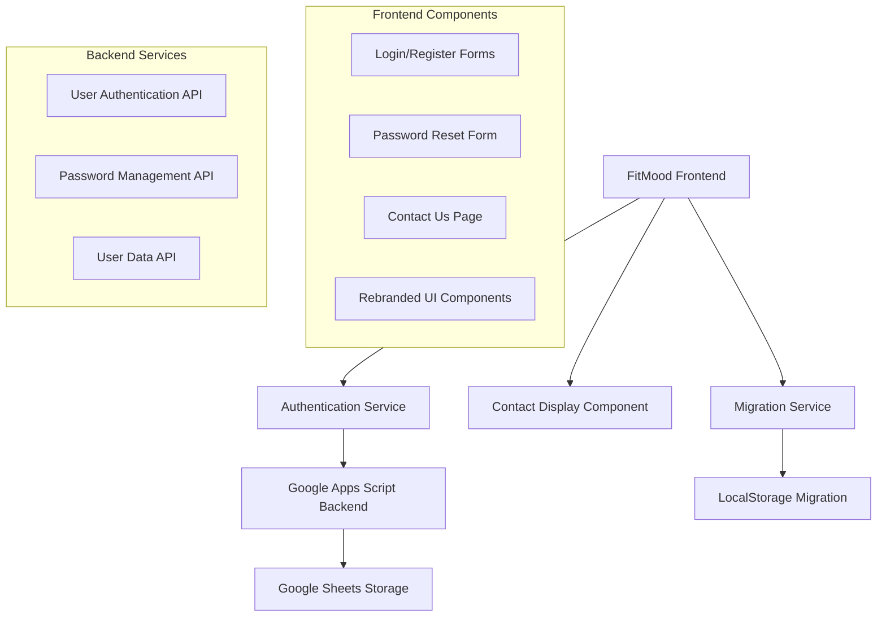
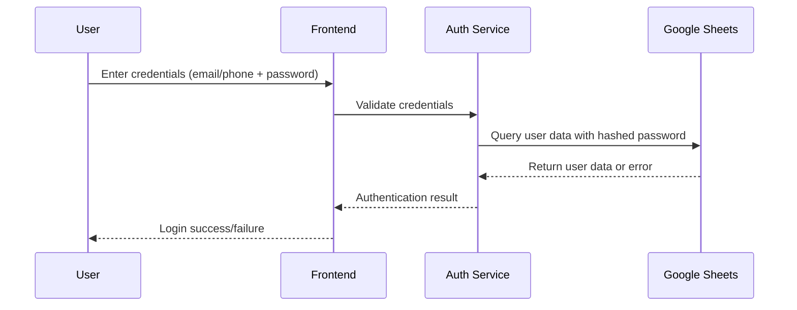

# Design Document

## Overview

This design document outlines the implementation approach for transforming the mood tracking application from "Moodly" to "FitMood" with enhanced password-based authentication and contact information display. The design focuses on maintaining existing functionality while adding secure authentication and seamless rebranding.

## Architecture

### High-Level Architecture



### Authentication Flow



## Components and Interfaces

### 1. Authentication Service Interface

```typescript
interface AuthenticationService {
  // Registration
  register(userData: {
    name: string;
    email: string;
    phone: string;
    password: string;
  }): Promise<AuthResult>;
  
  // Login with email or phone
  login(credentials: {
    identifier: string; // email or phone
    password: string;
  }): Promise<AuthResult>;
  
  // Password reset
  requestPasswordReset(identifier: string): Promise<ResetResult>;
  resetPassword(token: string, newPassword: string): Promise<ResetResult>;
  
  // Password validation
  validatePassword(password: string): ValidationResult;
}

interface AuthResult {
  success: boolean;
  user?: UserData;
  error?: string;
  token?: string;
}
```

### 2. Migration Service Interface

```typescript
interface MigrationService {
  // Migrate localStorage keys from moodly_ to fitmood_
  migrateStorageKeys(): Promise<MigrationResult>;
  
  // Prompt existing users to set password
  promptPasswordSetup(userId: string): Promise<boolean>;
  
  // Clean up old storage keys
  cleanupOldKeys(): void;
}

interface MigrationResult {
  success: boolean;
  migratedKeys: string[];
  errors?: string[];
}
```

### 3. Contact Display Component

```typescript
interface ContactInfo {
  phone: string;
  address: {
    street: string;
    city: string;
    state: string;
    zipCode: string;
    country: string;
  };
  businessHours?: string;
  email?: string;
}

interface ContactDisplayProps {
  contactInfo: ContactInfo;
  theme: 'light' | 'dark';
}
```

## Data Models

### Enhanced User Model

```typescript
interface User {
  userId: string;
  name: string;
  email: string;
  phone: string;
  passwordHash: string;  // New field
  salt: string;          // New field
  role: 'user' | 'admin';
  createdAt: string;
  lastLogin?: string;
  passwordResetToken?: string;
  passwordResetExpiry?: string;
  migrationStatus?: 'pending' | 'completed'; // New field
}
```

### Password Security Model

```typescript
interface PasswordSecurity {
  minLength: 8;
  requireSpecialChar: boolean;
  requireNumber: boolean;
  requireUppercase: boolean;
  hashAlgorithm: 'SHA-256'; // Using built-in browser crypto
  saltLength: 16;
}
```

## Correctness Properties

*A property is a characteristic or behavior that should hold true across all valid executions of a system—essentially, a formal statement about what the system should do. Properties serve as the bridge between human-readable specifications and machine-verifiable correctness guarantees.*

### Property Reflection

After reviewing the acceptance criteria, I've identified several areas where properties can be consolidated:

**Redundancy Analysis:**
- Properties 1.1 and 1.4 both test text replacement but can be combined into one comprehensive branding property
- Properties 2.3, 4.1, and 4.2 all test password storage and validation - can be consolidated
- Properties 4.4 and 4.5 overlap with data integrity concerns
- Properties 5.1 and 5.5 both test migration functionality

**Consolidated Properties:**

Property 1: Complete Branding Replacement
*For any* rendered component or stored data, all instances of "Moodly" should be replaced with "FitMood" and all storage keys should use "fitmood_" prefix
**Validates: Requirements 1.1, 1.3, 1.4**

Property 2: Password Security Round Trip
*For any* valid password, hashing then validating should confirm the original password matches
**Validates: Requirements 2.2, 2.3, 4.1, 4.4**

Property 3: Flexible Authentication
*For any* valid user with stored credentials, authentication should succeed using either email+password OR phone+password
**Validates: Requirements 2.4, 2.5, 4.2**

Property 4: Password Validation Rules
*For any* password input, validation should enforce minimum 8 characters with at least one special character
**Validates: Requirements 2.1, 2.2**

Property 5: Authentication Error Handling
*For any* invalid credentials, the system should return appropriate error messages without revealing whether email/phone exists
**Validates: Requirements 2.6**

Property 6: Data Migration Preservation
*For any* existing user data, migration should preserve all mood history and preferences while updating storage keys
**Validates: Requirements 5.1, 5.3, 5.4, 5.5**

Property 7: Password Reset Functionality
*For any* valid user identifier, password reset should generate secure tokens and allow password updates
**Validates: Requirements 4.3**

## Error Handling

### Authentication Errors
- **Invalid Credentials**: Generic "Invalid login credentials" message to prevent user enumeration
- **Password Validation**: Real-time feedback on password requirements
- **Rate Limiting**: Implement progressive delays for failed login attempts
- **Account Lockout**: Temporary lockout after multiple failed attempts

### Migration Errors
- **Storage Conflicts**: Handle cases where both old and new keys exist
- **Data Corruption**: Validate data integrity during migration
- **Partial Migration**: Rollback mechanism for failed migrations

### Backend Integration Errors
- **Network Failures**: Offline queue for authentication attempts
- **Google Sheets Limits**: Handle API rate limits and quota exceeded errors
- **Data Validation**: Server-side validation of all user inputs

## Testing Strategy

### Dual Testing Approach
The testing strategy combines unit tests for specific scenarios with property-based tests for comprehensive coverage:

**Unit Tests:**
- Specific password validation scenarios (edge cases)
- Contact information display components
- Migration workflow for existing users
- Error message formatting and display

**Property-Based Tests:**
- Password hashing and validation across all possible inputs
- Branding replacement across all UI components
- Authentication flows with various credential combinations
- Data migration with different localStorage states

**Property Test Configuration:**
- Minimum 100 iterations per property test
- Each test tagged with: **Feature: fitmood-enhancement, Property {number}: {property_text}**
- Use fast-check library for JavaScript property-based testing
- Generate random user data, passwords, and storage states for comprehensive testing

### Integration Testing
- End-to-end authentication flows
- Google Apps Script backend integration
- PWA installation and manifest verification
- Cross-browser compatibility for localStorage migration

## Implementation Phases

### Phase 1: Backend Password Support
1. Update Google Apps Script to handle password hashing
2. Modify user registration to include password field
3. Update login logic to validate passwords
4. Add password reset functionality

### Phase 2: Frontend Authentication Enhancement
1. Update registration form with password field
2. Modify login form to accept email/phone + password
3. Add password validation and strength indicator
4. Implement forgot password workflow

### Phase 3: Rebranding Implementation
1. Replace all "Moodly" text with "FitMood"
2. Update localStorage key prefixes
3. Modify PWA manifest and metadata
4. Update all UI components and styling

### Phase 4: Migration and Contact Features
1. Implement localStorage migration service
2. Add contact information display
3. Create migration prompts for existing users
4. Comprehensive testing and validation

## Security Considerations

### Password Security
- **Client-side hashing**: Use Web Crypto API for SHA-256 hashing before transmission
- **Salt generation**: Generate unique salt per user using crypto.getRandomValues()
- **No plaintext storage**: Never store or transmit plaintext passwords
- **Secure transmission**: All authentication over HTTPS only

### Data Protection
- **Input sanitization**: Validate and sanitize all user inputs
- **XSS prevention**: Escape all user-generated content
- **CSRF protection**: Implement request validation tokens
- **Session management**: Secure token storage and expiration

### Google Apps Script Security
- **Script permissions**: Minimal required permissions only
- **Data validation**: Server-side validation of all requests
- **Error handling**: No sensitive information in error messages
- **Access control**: Proper authentication for all endpoints

## Backend API Changes

The existing Google Apps Script backend requires the following modifications:

### New API Endpoints
```javascript
// Enhanced registration with password
function registerUser(data) {
  // Add password hashing and storage
  // Validate password requirements
  // Store hashed password and salt
}

// Enhanced login with password validation
function loginUser(data) {
  // Support email OR phone + password
  // Validate against stored hash
  // Return authentication result
}

// Password reset functionality
function requestPasswordReset(data) {
  // Generate reset token
  // Store token with expiration
  // Return success/failure
}

function resetPassword(data) {
  // Validate reset token
  // Update password hash
  // Invalidate reset token
}
```

### Database Schema Updates
```javascript
// Users sheet columns:
// [ID, Name, Email, Phone, Role, Created, LastActive, PasswordHash, Salt, ResetToken, ResetExpiry]
```

The provided Google Apps Script code will be updated to include these password management features while maintaining backward compatibility with existing functionality.